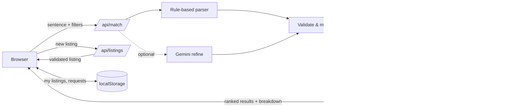

# OneWear

**Rent the outfit, not the wardrobe.** Describe your occasion in one sentence and OneWear finds outfits that people near you in Chennai are lending, in your size, within your budget, and free on your date.

Built for **HACKXPRESS 1.0, Problem Statement 4: Resource-Intensive Consumer Culture & Environmental Impact** ("Wear Once, Don't Buy").

**Live demo:** `https://<your-project>.vercel.app`

---

## The problem

People buy expensive clothes for one occasion (weddings, interviews, parties, photoshoots, college events) and then never wear them again. That wastes money, and every new garment costs thousands of litres of water and kilograms of CO₂ to produce. Rental stores exist, but they hold their own central stock. The outfits already sitting unused in wardrobes across a city are never matched to the people who need them next week.

## What OneWear does

1. **Occasion-first search.** Type *"Cousin's sangeet in Anna Nagar next Saturday, size M, under ₹900, nothing too loud"*. OneWear extracts the occasion, size, budget, date, area and the look you want.
2. **Explainable matching.** Every result shows a match percentage and a per-factor breakdown (occasion, size, distance, budget, style), so you know exactly why it ranked there.
3. **Availability with a cleaning buffer.** Each booking blocks an outfit from 1 day before the event (pickup) to 2 days after (return and dry-cleaning). Clashing outfits are hidden automatically.
4. **Rental request flow.** Shows the pickup, event, return and cleaning timeline, the rental fee, the refundable deposit, and the estimated water, CO₂ and money saved versus buying new.
5. **Lend an outfit.** A validated listing form. Your new listing immediately appears in your own searches.

## How matching works

```
score = 0.30 × occasion + 0.25 × size + 0.20 × distance + 0.15 × budget + 0.10 × style
```

| Factor | Weight | Scoring |
|---|---|---|
| Occasion | 30% | 1.0 if tagged for the occasion, 0.5 if a related occasion, else 0 |
| Size | 25% | 1.0 exact, 0.4 one size away (alteration), else 0 |
| Distance | 20% | Linear from 1.0 at 0 km to 0 at 25 km (haversine distance) |
| Budget | 15% | 1.0 within budget, falls to 0 at 25% over |
| Style | 10% | Share of requested looks matched, plus garment-type match |

Unspecified factors get a neutral 0.7. Hard filters (availability, who it's for) run before scoring. Ties break on distance, then price. The full explanation is also on the `/how` page of the app.

**AI with a safety net.** A deterministic rule-based parser always runs. If `GEMINI_API_KEY` is set, Gemini also reads the sentence; its output is validated against the same allowed values and merged in. If the AI is missing, slow (4 s timeout) or returns invalid JSON, the rule-based result is used. Search never fails because of the AI.

## Architecture



## Tech stack

- **Next.js (App Router)**: frontend and API routes in one project, deployed on Vercel
- **Plain JavaScript and CSS**: no UI framework, CSS-drawn fabric swatches instead of images
- **Google Gemini** (optional): natural-language refinement
- **Node's built-in test runner**: unit tests for parsing, scoring and validation

## Project structure

```
app/
  page.js              Find an outfit (search, refine, results, booking)
  list/page.js         Lend an outfit (validated form)
  how/page.js          How matching works
  api/match/route.js   Parse → filter → score → rank
  api/listings/route.js  Validate new listings
components/            Header, ResultCard, BookingDialog, Swatch
lib/
  parser.js            Rule-based sentence parser
  llm.js               Optional Gemini refinement with timeout + fallback
  scoring.js           Weights, availability buffer, ranking
  validate.js          Server-side sanitisation of all input
  listings.js          Seed inventory (36 outfits across Chennai)
  areas.js             Neighbourhood coordinates + haversine distance
  catalog.js           Shared vocabulary (sizes, occasions, styles, impact)
  rateLimit.js         Per-IP request limiting
  storage.js           Guarded localStorage helpers
tests/                 12 unit tests
```

## Security and error handling

- Every API input is validated and sanitised on the server; invalid values are dropped, never trusted
- Request size limits (500-character descriptions, max 20 client listings per search)
- Per-IP rate limiting on both API routes (returns 429 with a clear message)
- Security headers: `X-Content-Type-Options`, `X-Frame-Options`, `Referrer-Policy`, `Permissions-Policy`
- API keys only in environment variables; `.env` is git-ignored
- AI calls have a timeout and full fallback
- UI handles loading, empty, offline and error states with specific guidance

## Run locally

```bash
npm install
npm run dev        # http://localhost:3000
npm test           # 12 unit tests
```

Optional AI: copy `.env.example` to `.env.local` and add a free key from Google AI Studio.

## Deploy

Import the repo on [vercel.com](https://vercel.com) → Framework: Next.js → Deploy. Optionally add `GEMINI_API_KEY` under Project → Settings → Environment Variables.

## Prototype limits and next steps

- Listings are 36 seeded outfits plus any you add in your browser. Next: a shared database (Supabase/Postgres) with lender accounts.
- Requests are stored locally. Next: lender accept/decline, UPI deposit escrow, and in-app chat.
- Trust: ID-verified lenders and borrowers, before/after condition photos for damage disputes.
- Launch plan: college campuses first, where events create repeat demand in a small radius, plus local boutiques that already rent informally.

## Business model

A 15% commission on each rental, plus a membership that waives deposits and gives early access to high-demand outfits during wedding season.
